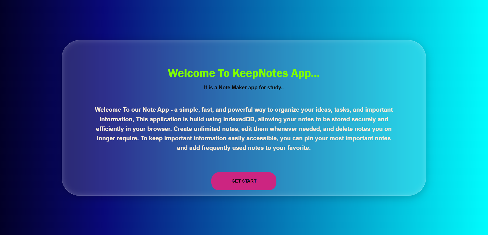
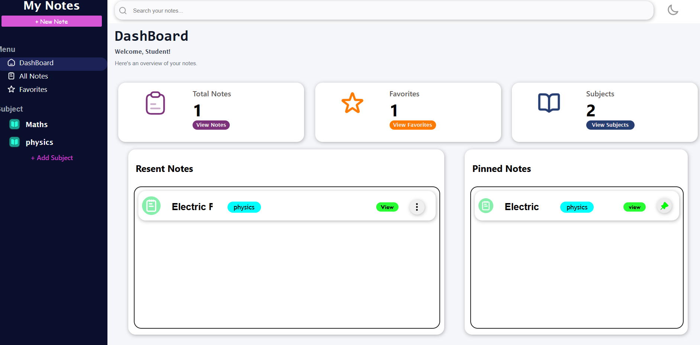
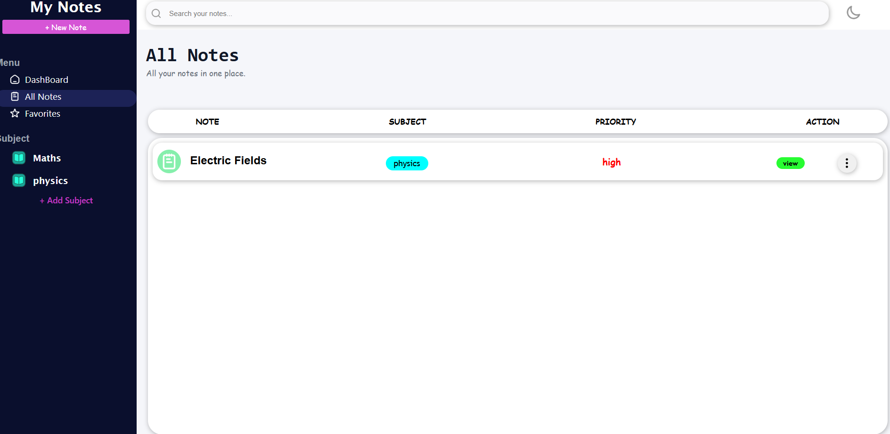
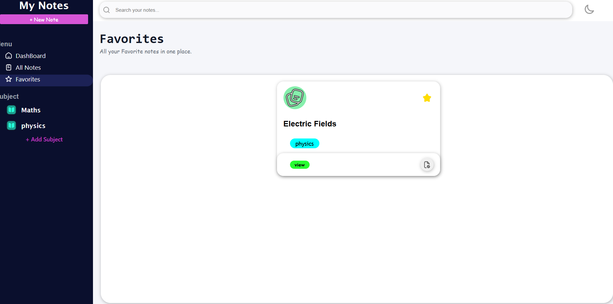
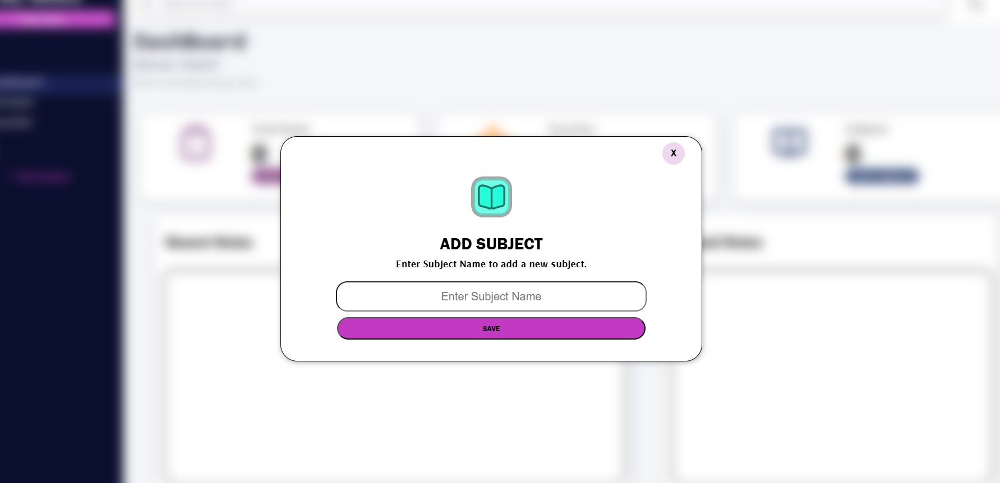
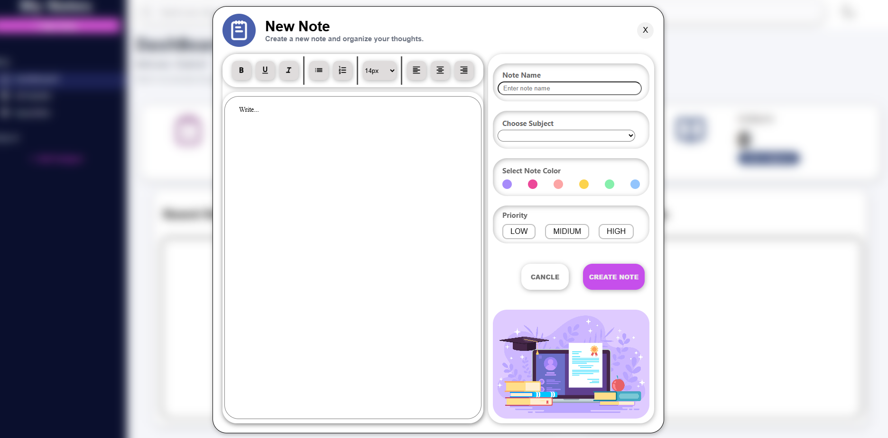
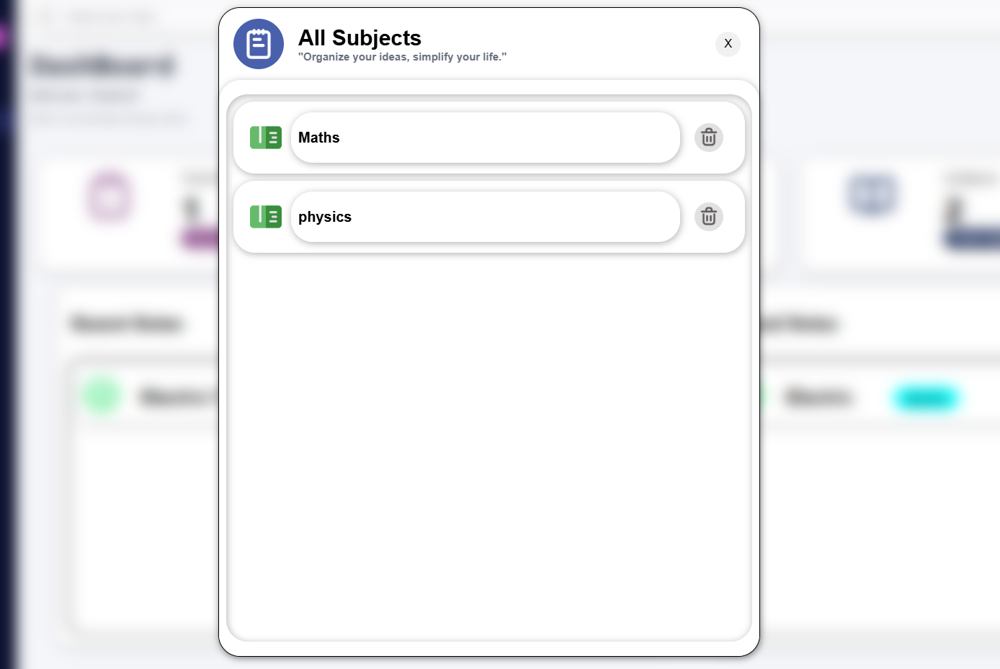
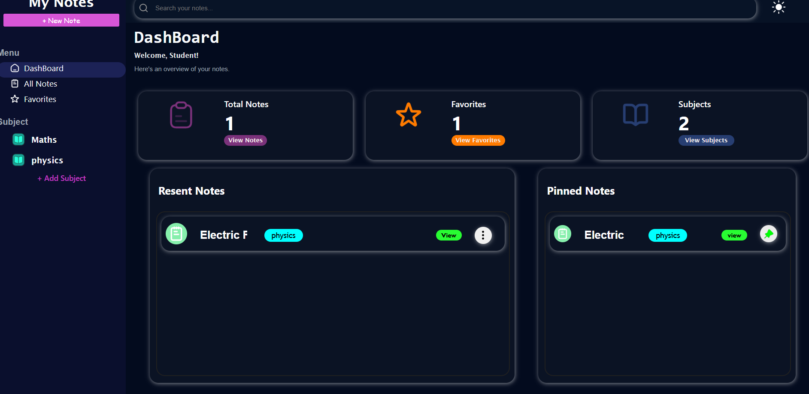

# 📝 My Note Maker

A modern note-taking web application built using **HTML, CSS, and JavaScript**. The application helps users organize their notes by creating subjects, pinning important notes, marking favorites, and storing everything locally using **IndexedDB** and **Local Storage**.

🌐 **Live Demo:** https://mynotemaker.vercel.app

---

# 📖 About The Project

My Note Maker is a browser-based note management system designed to help users keep their notes organized and easily accessible.

Users can create different subjects and store notes under those subjects. Important notes can be pinned, favorite notes can be highlighted, and all data is automatically saved inside the browser.

Unlike many beginner note applications that rely only on Local Storage, this project uses **IndexedDB** to manage note data efficiently and provide better scalability.

This was my **first complete static website project**, and it took approximately **one month** to design, develop, debug, and complete.

---

# ✨ Features

## 📂 Subject Management

- Create custom subjects
- Organize notes by subject
- Navigate between different subjects easily
- Subject names stored using Local Storage

## 📝 Note Management

- Create notes
- Delete notes
- Store notes permanently
- Fast retrieval using IndexedDB

## 📌 Pin Important Notes

- Pin notes for quick access
- Keep important notes at the top

## ⭐ Favorite Notes

- Mark notes as favorites
- Quickly identify important notes

## 💾 Persistent Data Storage

- Data remains available after page refresh
- No login required
- Fully browser-based storage

## 🎨 Modern UI

- Clean and minimal design
- Responsive layout
- User-friendly interface
- Smooth user experience

---

# 🛠️ Technologies Used

- HTML
- CSS
- JavaScript
- IndexedDB
- Local Storage

---

# 🗄️ Storage Architecture

## Local Storage

Used for:

- Subject names
- User preferences

## IndexedDB

Used for:

- Note title
- Note content
- Note priority
- Favorite status
- Pinned status
- Subject-related note data

Using IndexedDB improves performance and allows handling larger amounts of data compared to Local Storage.

---

# 🚀 How It Works

1. Create a subject.
2. Open the subject.
3. Create notes under that subject.
4. Pin important notes.
5. Add notes to favorites.
6. Delete notes when no longer needed.
7. All data is automatically saved inside the browser.

---

# 📚 What I Learned

Building this project helped me learn:

- DOM Manipulation
- Event Handling
- Browser Storage APIs
- Local Storage
- IndexedDB
- Data Management
- Debugging Complex JavaScript Applications
- Responsive Web Design
- UI/UX Design

---

# 💡 Challenges Faced

## Learning IndexedDB

This was my first time working with IndexedDB. Understanding databases, object stores, transactions, requests, and data retrieval was one of the biggest challenges of this project.

## Managing Data

Handling notes, favorites, pinned notes, priorities, and subjects while keeping everything synchronized required a lot of planning and debugging.

## Debugging Issues

I faced many issues related to:

- Data storage
- Data retrieval
- UI updates
- Event handling
- Database operations

Solving these problems significantly improved my JavaScript skills.

## First Major Static Website Project

This project was my first complete static web application. Building everything from scratch taught me how real-world applications are structured and managed.

## One Month Development Journey

The entire project took approximately **one month** to complete. During this time, I continuously improved the UI, fixed bugs, optimized performance, and learned new web development concepts.

---

# 📂 Project Structure

```text
My Note Maker/
│
├── About Page/
│   └── index.html
│
├── Dashboard Page/
│   ├── dashboard.html
│   │
│   ├── css/
│   │   ├── style.css
│   │   └── about.css
│   │
│   ├── js/
│   │   └── script.js
│   │
│   ├── assets/
│   │
│   └── screenshots/
│
└── README.md
```

---

# 🎯 Future Improvements

- Search functionality
- Edit existing notes
- Exports notes
- Dark mode support
- Cloud synchronization
- User accounts
- Note sharing
- Backup and restore features

---

# 📸 Screenshots

## About Page



## Dashboard



## All Notes



## Favourite Notes


## Add Subject


## Create Notes


## View Notes


## View All Subjects


## Dark Mode UI


---

# 👨‍💻 Developer

**Talib Alam**

Built with dedication, patience, and continuous learning.

This project represents my journey of learning JavaScript, IndexedDB, browser storage, and modern web development through hands-on experience.

If you like this project, consider giving it a ⭐ on GitHub.
